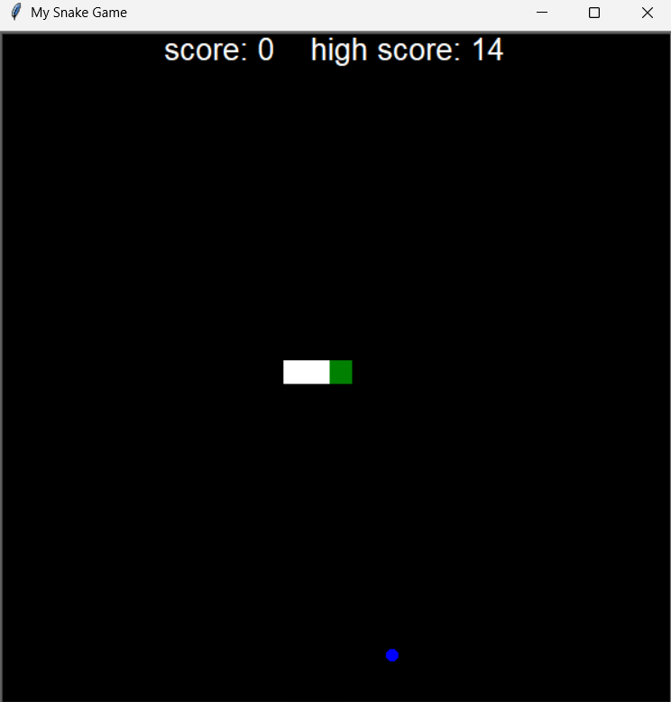

# 🐍 Snake Game in Python  

A classic Snake game implemented in **Python** using the **turtle graphics library** and **Object-Oriented Programming (OOP)** concepts.  

## 🎮 Features  
- Object-Oriented structure for clean and modular code  
- Live score tracking  
- Automatic restart when the snake hits the wall or itself  
- Simple controls for smooth gameplay  
- Nostalgic retro feel!  

## 🕹️ Controls  
- **Arrow Keys** to move the snake:  
  - ⬆️ Up  
  - ⬇️ Down  
  - ⬅️ Left  
  - ➡️ Right  

## 🚀 How to Play  
1. Clone this repository:  
   ```bash
   git clone https://github.com/your-username/snake-game.git

## 📸 Preview  



## 💡 Inspiration
This project is a fun way to practice Python basics, OOP concepts, and turtle graphics while recreating a nostalgic childhood game.
